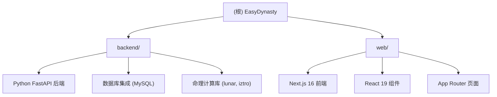

# EasyDynasty - AI 驱动的综合命理平台

> 最后更新：2026-01-20 18:27:24

## 变更记录 (Changelog)

### 2026-01-20
- 初始化 AI 上下文文档
- 识别 backend（Python FastAPI）和 web（Next.js 16）两大模块
- 生成 Mermaid 模块结构图
- 建立模块级文档索引

---

## 项目愿景

EasyDynasty（易朝）是一个融合塔罗牌、八字和紫微斗数的 AI 驱动命理平台。通过现代 Web 技术和人工智能，为用户提供沉浸式的神秘学体验和个性化解读。

**核心特性：**
- 78 张完整塔罗牌数据库（含正逆位关键词）
- 6 种经典牌阵布局
- AI 驱动的智能解读（支持 OpenAI 兼容 API）
- 流式响应（SSE）实时分析
- 占卜历史管理（本地存储，最多 50 条）
- 双 LLM 配置模式（服务器默认 + 用户自定义）
- 精美的 3D 翻转动画和飞牌效果

---

## 模块结构图



---

## 模块索引

| 模块路径 | 语言/框架 | 职责 | 入口文件 | 文档链接 |
|---------|----------|------|---------|---------|
| **backend/** | Python 3.11 + FastAPI | 后端 API 服务、数据库交互、命理计算 | `main.py` | [backend/CLAUDE.md](./backend/CLAUDE.md) |
| **web/** | Next.js 16 + React 19 + TypeScript | 前端用户界面、塔罗抽牌、AI 解读 | `app/layout.tsx` | [web/CLAUDE.md](./web/CLAUDE.md) |

---

## 架构总览

### 技术栈

**后端 (backend/)**
- **框架**: FastAPI 0.109.0
- **数据库**: MySQL (通过 SQLAlchemy 2.0 + PyMySQL)
- **命理库**: lunar-python 1.3.10（农历）、iztro-py 0.3.3（紫微斗数）
- **配置管理**: Pydantic Settings 2.1.0
- **服务器**: Uvicorn 0.27.0

**前端 (web/)**
- **框架**: Next.js 16.0.10 (App Router)
- **UI 库**: React 19.2.0
- **样式**: Tailwind CSS v4
- **语言**: TypeScript 5
- **Markdown**: react-markdown 10.1.0
- **字体**: Geist Sans/Mono, Cinzel, Playfair Display

### 架构模式

**前后端分离 + 双 LLM 配置**

1. **默认 LLM（服务器端）**：通过 Next.js API Route (`/api/chat`) 代理请求，保护服务器端 API 密钥
2. **自定义 LLM（用户配置）**：用户可在设置页面配置自己的 OpenAI 兼容 API，直接从浏览器发起请求

**数据流：**
```
Home (输入问题+选择牌阵)
  → sessionStorage 传递
    → Draw (扇形牌阵选牌)
      → sessionStorage 传递
        → Analysis (AI 流式解读 + 追问聊天)
          → historyManager.saveReading()
            → History (历史记录列表/详情)
```

**存储策略：**
- **sessionStorage**: 当前占卜流程（问题、牌阵、抽中的牌）
- **localStorage**: API 配置、占卜历史（最多 50 条）

---

## 运行与开发

### 后端启动

```bash
cd backend

# 创建虚拟环境（首次）
python3 -m venv venv
source venv/bin/activate  # Windows: venv\Scripts\activate

# 安装依赖
pip install -r requirements.txt

# 配置环境变量（可选，默认见 app/core/config.py）
cp .env.example .env
# 编辑 .env 配置数据库连接

# 初始化数据库（首次）
python init_db.py

# 启动开发服务器
uvicorn main:app --reload --port 8000
```

**访问**: http://localhost:8000
**API 文档**: http://localhost:8000/docs (Swagger UI)

### 前端启动

```bash
cd web

# 安装依赖
npm install

# 配置环境变量（可选）
cp .env.example .env
# 编辑 .env 配置默认 LLM（见 .env.example）

# 启动开发服务器
npm run dev        # 使用 Webpack（默认）
npm run dev:turbo  # 使用 Turbopack（更快，实验性）

# 生产构建
npm run build
npm start
```

**访问**: http://localhost:3000

### 环境变量说明

**后端 (.env)**
```bash
# 数据库配置（默认值在 app/core/config.py）
DB_USER=root
DB_PASSWORD=your_password
DB_HOST=localhost
DB_PORT=3306
DB_NAME=easydynasty
```

**前端 (.env)**
```bash
# 默认 LLM 配置（服务器端，密钥不暴露到客户端）
DEFAULT_LLM_ENABLED=false
DEFAULT_LLM_BASE_URL=https://api.openai.com/v1
DEFAULT_LLM_API_KEY=sk-your-api-key-here
DEFAULT_LLM_MODEL=gpt-4o-mini

# 客户端标识（仅用于显示）
NEXT_PUBLIC_DEFAULT_LLM_AVAILABLE=false
NEXT_PUBLIC_DEFAULT_LLM_MODEL=gpt-4o-mini
```

---

## 测试策略

### 当前状态

**后端**：
- 无测试文件（待补充）
- 建议添加 pytest + pytest-asyncio
- 重点测试：数据库 CRUD、API 端点、命理计算

**前端**：
- 无测试文件（待补充）
- 建议添加：
  - Jest + React Testing Library（组件测试）
  - Playwright（E2E 测试）
  - 重点测试：抽牌逻辑、SSE 流式解析、历史记录管理

---

## 编码规范

### Python (backend/)
- 遵循 PEP 8
- 使用 Pydantic 进行数据验证
- SQLAlchemy ORM 模型继承 `Base` 基类
- 配置集中管理在 `app/core/config.py`

### TypeScript/React (web/)
- 使用 TypeScript 严格模式
- ESLint 配置：`eslint.config.mjs`
- 所有交互式页面使用 `'use client'` 指令
- 组件命名：PascalCase (如 `FanDeck.tsx`)
- 工具函数命名：camelCase (如 `llmConfig.ts`)
- 类型定义集中管理：`types/tarot.ts`

---

## AI 使用指引

### 适合 AI 辅助的任务

1. **添加新牌阵**：
   - 在 `data/spreads.json` 添加牌阵定义
   - 可选：在 `utils/prompts.ts` 的 `spreadPromptGuidance` 添加解读指导
   - 可选：在 `app/draw/page.tsx` 的 `renderSpreadLayout()` 添加布局逻辑

2. **自定义 AI 解读风格**：
   - 编辑 `utils/prompts.ts` 的系统提示词和用户提示词
   - 调整 `spreadPromptGuidance` 添加牌阵特定指导

3. **扩展命理功能**：
   - 后端集成 `lunar-python` 和 `iztro-py` 库
   - 添加八字、紫微斗数相关的 API 端点

4. **UI 组件开发**：
   - 所有组件在 `components/` 目录
   - 遵循现有的 glass-panel 风格（`border border-white/20 bg-white/5 backdrop-blur`）
   - 使用 Tailwind CSS v4

5. **状态管理和数据流**：
   - 页面间传递：`sessionStorage`
   - 持久化：`localStorage` + `historyManager`
   - SSE 流式解析：`utils/sseParser.ts`

### 重要上下文文件

**前端核心流程：**
- `app/page.tsx` → `app/draw/page.tsx` → `app/analysis/page.tsx`
- `hooks/useTarotAnalysis.ts`: AI 分析主逻辑
- `components/TarotChat.tsx`: 追问聊天组件
- `utils/prompts.ts`: AI 提示词工程

**后端扩展点：**
- `main.py`: API 路由注册
- `app/core/config.py`: 配置管理
- `app/db/session.py`: 数据库会话
- `app/db/base.py`: ORM 基类

---

## 目录结构

```
EasyDynasty/
├── backend/                    # Python FastAPI 后端
│   ├── app/
│   │   ├── core/              # 核心配置
│   │   │   └── config.py      # Pydantic Settings
│   │   └── db/                # 数据库
│   │       ├── base.py        # ORM 基类
│   │       └── session.py     # SQLAlchemy 会话
│   ├── main.py                # FastAPI 应用入口
│   ├── init_db.py             # 数据库初始化脚本
│   ├── requirements.txt       # Python 依赖
│   └── venv/                  # 虚拟环境（忽略）
│
├── web/                        # Next.js 16 前端
│   ├── app/                   # App Router 页面
│   │   ├── analysis/page.tsx  # AI 解读页面
│   │   ├── api/chat/route.ts  # 默认 LLM 代理 API
│   │   ├── draw/page.tsx      # 抽牌页面
│   │   ├── history/           # 历史记录
│   │   │   ├── [id]/page.tsx  # 历史详情
│   │   │   └── page.tsx       # 历史列表
│   │   ├── settings/page.tsx  # API 设置页面
│   │   ├── layout.tsx         # 根布局
│   │   ├── page.tsx           # 首页（问题+牌阵选择）
│   │   └── globals.css        # 全局样式
│   ├── components/            # React 组件
│   │   ├── AnalysisDisplay.tsx    # 解读结果展示
│   │   ├── DrawnCardsDisplay.tsx  # 抽中的牌展示
│   │   ├── FanDeck.tsx           # 扇形牌阵选牌
│   │   ├── FlipCard.tsx          # 3D 翻转牌
│   │   ├── FlyingCard.tsx        # 飞牌动画
│   │   ├── ModelSelector.tsx     # 模型选择器
│   │   ├── SpreadLayout.tsx      # 牌阵布局
│   │   ├── TarotCard.tsx         # 单张塔罗牌
│   │   ├── TarotChat.tsx         # 追问聊天
│   │   └── Toast.tsx             # 提示消息
│   ├── data/                 # 静态数据
│   │   ├── spreads.json      # 6 种牌阵定义
│   │   └── tarot-cards.json  # 78 张塔罗牌数据
│   ├── hooks/                # 自定义 Hooks
│   │   └── useTarotAnalysis.ts  # AI 分析主 Hook
│   ├── types/                # TypeScript 类型
│   │   └── tarot.ts          # 塔罗相关类型定义
│   ├── utils/                # 工具函数
│   │   ├── cardImages.ts     # 卡牌图片映射
│   │   ├── historyManager.ts # 历史记录管理
│   │   ├── llmConfig.ts      # LLM 配置工具
│   │   ├── prompts.ts        # AI 提示词
│   │   └── sseParser.ts      # SSE 流式解析
│   ├── public/               # 静态资源
│   │   └── cards/            # 78 张卡牌图片
│   ├── package.json          # Node.js 依赖
│   ├── tsconfig.json         # TypeScript 配置
│   ├── next.config.ts        # Next.js 配置
│   ├── eslint.config.mjs     # ESLint 配置
│   ├── postcss.config.mjs    # PostCSS 配置
│   └── .env.example          # 环境变量示例
│
├── .git/                      # Git 仓库
├── CLAUDE.md                  # 本文件（根级文档）
└── README.md                  # 项目说明（待创建）
```

---

## 常见问题 (FAQ)

### Q1: 为什么选择双 LLM 配置模式？
**A**:
- **默认 LLM**：方便不想配置 API 的用户，服务器端统一管理，但成本由服务器承担
- **自定义 LLM**：保护隐私（用户数据不经过服务器），支持各种 OpenAI 兼容 API（如 DeepSeek、Claude 等）

### Q2: 前端为什么没有使用 Redux/Zustand 等状态管理库？
**A**: 当前数据流较简单，使用 `sessionStorage` + `localStorage` + React Hooks 已足够。如未来状态复杂化，可引入 Zustand。

### Q3: 后端为什么使用 MySQL 而不是 PostgreSQL？
**A**: 当前项目选择 MySQL 是基于现有基础设施。如需迁移，SQLAlchemy 支持多种数据库，修改 `DATABASE_URI` 即可。

### Q4: 如何添加新的命理功能（如八字、紫微斗数）？
**A**:
- 后端已安装 `lunar-python` 和 `iztro-py`
- 在 `backend/app/` 添加新的 API 路由
- 前端添加对应的页面和组件

---

## 下一步建议

### 功能扩展
1. **用户系统**：添加登录/注册，历史记录云端同步
2. **社交功能**：分享占卜结果，社区交流
3. **多语言**：国际化（i18n）支持英文、日文等
4. **移动端优化**：PWA 支持，响应式设计优化
5. **更多牌阵**：添加凯尔特十字、星阵等高级牌阵

### 技术优化
1. **测试覆盖**：补充单元测试和 E2E 测试
2. **错误处理**：统一错误处理和日志记录
3. **性能优化**：图片懒加载、代码分割、SSR 优化
4. **安全性**：API Rate Limiting、输入验证、CSRF 防护
5. **监控**：添加应用性能监控（APM）和错误追踪

### 文档完善
1. **API 文档**：补充 OpenAPI 规范
2. **部署文档**：Docker Compose、Kubernetes 配置
3. **贡献指南**：CONTRIBUTING.md
4. **README 翻译**：英文版 README

---

## 相关链接

- **项目位置**: `/Users/xushaoyang/Desktop/命理与塔罗/EasyDynasty`
- **后端文档**: [backend/CLAUDE.md](./backend/CLAUDE.md)
- **前端文档**: [web/CLAUDE.md](./web/CLAUDE.md)
- **初始化时间**: 2026-01-20 18:27:24
