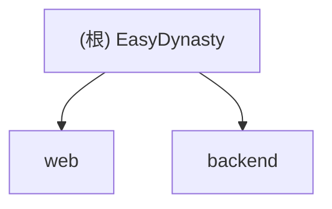

# EasyDynasty 项目文档

> 最后更新：2026-01-24 21:12:04

## 变更记录 (Changelog)

- **2026-01-24**: 初始化项目文档体系；生成模块结构图；扫描 web 与 backend 模块。

## 项目愿景

EasyDynasty 是一个融合传统命理（塔罗、八字、紫微斗数）与现代 AI 技术的综合占卜平台，旨在通过沉浸式的交互体验与深度的大语言模型解读，为用户提供个性化、富有洞察力的指引。

## 架构总览

项目采用前后端分离架构：
- **前端 (Web)**: Next.js + React 19，负责沉浸式 UI、3D 动画与流式交互。
- **后端 (Backend)**: Python FastAPI，负责业务逻辑、AI 代理、Redis 缓存与第三方服务集成。

### 模块结构图



## 模块索引

| 模块 | 路径 | 主要职责 | 语言/框架 |
| :--- | :--- | :--- | :--- |
| **Web** | [web](./web/CLAUDE.md) | 用户界面、3D 动画、AI 流式交互 | TypeScript, Next.js 16 |
| **Backend** | [backend](./backend/CLAUDE.md) | API 服务、AI 代理、数据缓存 | Python, FastAPI |

## 运行与开发

### 前端启动
```bash
cd web
npm install
npm run dev
```

### 后端启动
```bash
cd backend
python -m venv venv
# Windows
.\venv\Scripts\activate
pip install -r requirements.txt
uvicorn main:app --reload
```

## 编码规范

- **路径引用**: 必须使用绝对路径或基于根目录的相对路径。
- **文档维护**: 每次重大变更后，请运行初始化脚本更新本文件及模块文档。
- **Git**: 提交前确保通过 Lint 检查。

## AI 使用指引

- **提问方式**: 涉及特定模块时，请先阅读该模块的 `CLAUDE.md` 获取上下文。
- **文件操作**: 修改代码前，请先读取相关文件内容；避免盲目覆盖。
